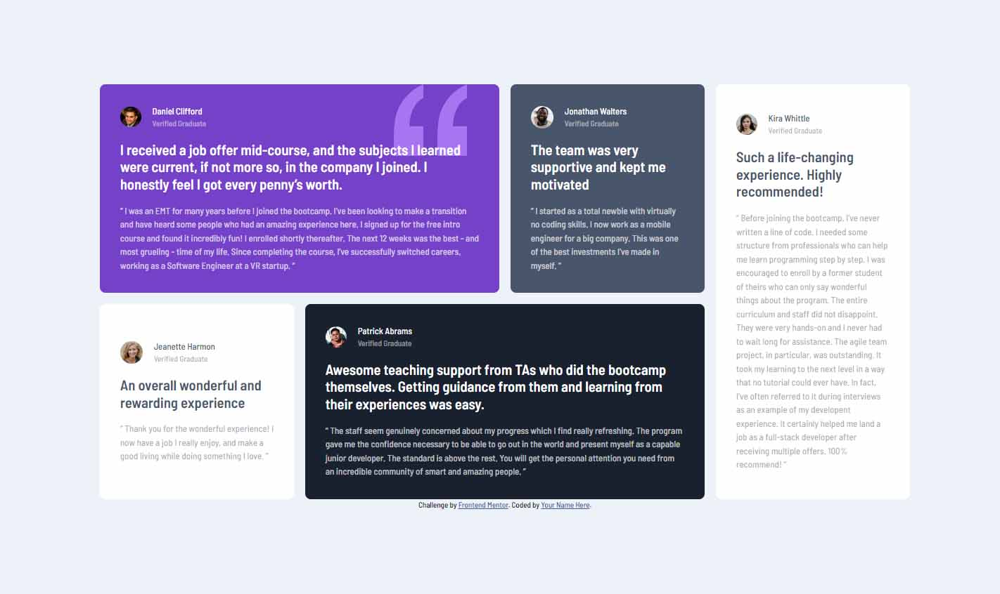

# Frontend Mentor - Testimonials grid section solution

This is a solution to the [Testimonials grid section challenge on Frontend Mentor](https://www.frontendmentor.io/challenges/testimonials-grid-section-Nnw6J7Un7). Frontend Mentor challenges help you improve your coding skills by building realistic projects.

## Table of contents

- [Overview](#overview)
  - [The challenge](#the-challenge)
  - [Screenshot](#screenshot)
  - [Links](#links)
- [My process](#my-process)
  - [Built with](#built-with)
  - [What I learned](#what-i-learned)
  - [Continued development](#continued-development)
  - [Useful resources](#useful-resources)
- [Author](#author)
- [Acknowledgments](#acknowledgments)

**Note: Delete this note and update the table of contents based on what sections you keep.**

## Overview

### The challenge

Users should be able to:

- View the optimal layout for the site depending on their device's screen size

### Screenshot

Desktop

Mobil

## My process

### Built with

- HTML5
- CSS
- Grid
- Flexbox

### What I learned

Combining Grid with flexbox

### Continued development

This is the very beginning of my journey.
I still want to practice HTML and CSS, learn bootstrap and Tailwind while moving to learn JS in the near future.

### Useful resources

- [Dave Gray](https://www.youtube.com/c/DaveGrayTeachesCode) - I learnt basic grid from here
- [w3schools](https://www.w3schools.com/) - This site helps me a lot solving specific problems

## Author

- Frontend Mentor - [@K-Muzslay](https://www.frontendmentor.io/profile/K-Muzslay)
